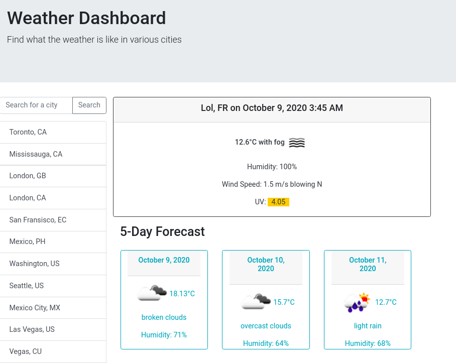

# [Work Day Scheduler](https://logner.github.io/weather-dashboard)

This is the week 6 project from the University of Toronto SCS bootcamp. I have used jquery, bootstrap and moment.js and the openWeathermap API for this project.

Enter Key is enabled for quicker searching, i am currently showing 5-day forecasts.

as always - this is a (semi) responsive app!

This project is deployed at: https://logner.github.io/weather-dashboard

